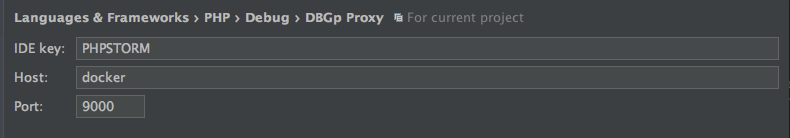
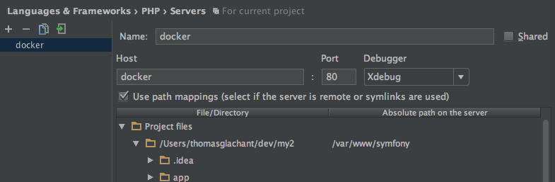

# Images PHP

## Usage

Exemple de configuration docker-compose :
```
web:
    image: "thomasglachant/docker:php7.1-fpm"
    depends_on:
       - db
       - blackfire
    volumes:
        - "./:/var/www/symfony"
        - "/var/www/symfony/app/cache"
        - "/var/www/symfony/app/logs"
    links:
        - "db:db"
        - "blackfire:blackfire"
    environment:
        - PHP_BLACKFIRE_ENABLED=0
        - PHP_XDEBUG_ENABLED=0
        - PHP_XDEBUG_HOST=
```

## Blackfire

Les images PHP-fpm permettent d'utiliser blackfire. 

Liste des variables d'environements disponibles (et leurs valeurs par défaut) : 

```
PHP_BLACKFIRE_ENABLED=0
PHP_BLACKFIRE_HOST=blackfire
PHP_BLACKFIRE_PORT=8707
```

Pour cela il faut disposer d'un container "blackfire/blackfire" (ex de docker-compose.yml): 
```
blackfire:
    image: "blackfire/blackfire"
    environment:
        - BLACKFIRE_SERVER_ID=
        - BLACKFIRE_SERVER_TOKEN=
```

## Xdebug 

Xdebug est disponible sur les containers PHP CLI et FPM. 
Par défaut, xdebug n'est pas activé.

Liste des variables d'environements disponibles (et leurs valeurs par défaut) : 
```
PHP_XDEBUG_ENABLED=0
PHP_XDEBUG_HOST=
PHP_XDEBUG_IDEKEY=PHPSTORM
PHP_XDEBUG_PORT=9000
PHP_XDEBUG_MAX_NESTING_LEVEL=1024
```

Si PHP_XDEBUG_HOST est null alors le script détectera automatiquement le host docker et le configurera.

### PHPStorm

Configurer le proxy DBGp : 



Puis ajouter un mapping : 




### Mac

Pour utiliser xdebug sous mac, il faut utiliser un alias ip. 

Créer l'alias : 
```bash
sudo ifconfig en0 alias 10.254.254.254 255.255.255.0
```

Puis modifier la config : 

```
PHP_XDEBUG_HOST=10.254.254.254
```

### Symfony

Pour injecter automatiquement les variables d'environement dans les parameters, il faut modifier
le composer.json pour qu'il contienne : 
```
"require": {
    "incenteev/composer-parameter-handler": "~2.0",
},
"post-install-cmd": [
    "Incenteev\\ParameterHandler\\ScriptHandler::buildParameters"
],
"post-update-cmd": [
    "Incenteev\\ParameterHandler\\ScriptHandler::buildParameters"
],
"extra": {
    "incenteev-parameters": {
        "file": "app/config/parameters.yml",
        "env-map": {
            /******* VARIABLES D'ENVIRONNEMENT ********/
        }
    },
}
```
